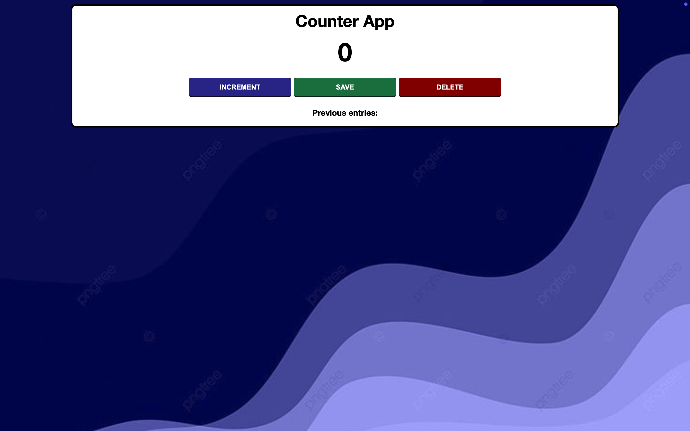

# Minimalistic-Counter-App📊
A simple yet effective counter application built with HTML, CSS, and JavaScript. This project was developed for practice and to reinforce fundamental JavaScript concepts.

### 🚀 Live Demo: Minimalistic Counter App
**https://counter-app-shyngys.netlify.app/**
### 🛠 Features
```
✅ Increment and track count
✅ Save previous entries
✅ Reset and delete entries
✅ Clean and responsive UI
✅ Deployed on Netlify for easy access
```

### 📸 Preview


### 📂 Project Structure
```
├── index.html     # Main HTML structure
├── index.css      # Styling for the web app
├── index.js       # JavaScript logic
├── package.json   # Project dependencies
├── yarn.jpg.png   # Background image
├── LICENSE        # MIT License
└── README.md      # Project documentation
```
### 📜 How to Use
```
1. Clone the repository
  git clone https://github.com/soyelsyhyngys/minimalistic-counter-app.git
  cd minimalistic-counter-app
2. Open index.html in your browser
  Simply double-click the file or use a live server (e.g., VSCode Live Server extension).
```
### 📌 Tech Stack 
```
🔹 HTML – Structuring the UI
🔹 CSS – Styling and responsiveness
🔹 JavaScript – Handling logic and state
```
### 🎨 UI Design
The app features a minimalist and user-friendly interface with three main buttons:
```
🔹 Increment ➝ Increases the counter
🔹 Save ➝ Stores the count history
🔹 Delete ➝ Clears all stored data
```
### 🏗️ Future Improvements
```
🔹 LocalStorage Integration – Persist saved counts between sessions
🔹 Animations & Transitions – Smoother UI experience
🔹 Dark Mode – User preference customization
```
### ⚖️ License
This project is licensed under the MIT License – feel free to modify and use it as needed.

### 🤝 Contributions
Want to improve this project? Feel free to fork the repository and submit a pull request! 🚀

### 📩 Questions? Reach out via GitHub Issues.


